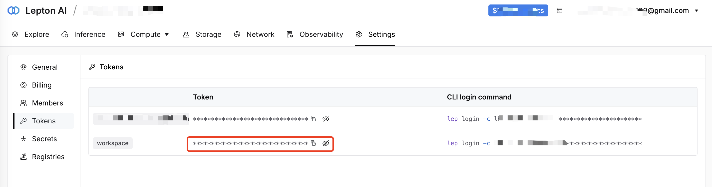

## Overview

GPUd is designed to ensure GPU efficiency and reliability by actively monitoring GPUs and effectively managing AI/ML workloads.

Unlike CPUs, GPU failures and issues are common and can significantly impact training and inference efficiency.

> "78% of unexpected interruptions are attributed to confirmed hardware issues, such as GPU or host component failures, or suspected hardware-related issues like silent data corruption and unplanned individual host maintenance events. GPU issues are the largest category, accounting for 58.7% of all unexpected issues."
>
> [*Reliability and Operational Challenges by Meta Llama team (2024)*](https://ai.meta.com/research/publications/the-llama-3-herd-of-models/)

GPUd addresses these challenges by automatically identifying, diagnosing, and repairing GPU-related issues, thereby minimizing downtime and maintaining high efficiency.

## Why GPUd

GPUd is built on years of experience operating large-scale GPU clusters at Meta, Alibaba Cloud, Uber, and Lepton AI. It is carefully designed to be self-contained and to integrate seamlessly with other systems such as Docker, containerd, Kubernetes, and Nvidia ecosystems.

- **First-class GPU support**: GPUd is GPU-centric, providing a unified view of critical GPU metrics and issues.
- **Easy to run at scale**: GPUd is a self-contained binary that runs on any machine with a low footprint.
- **Production grade**: GPUd is used in [Lepton AI](https://lepton.ai/)'s production infrastructure.

Most importantly, GPUd operates with minimal CPU and memory overhead in a non-critical path and requires only read-only operations. See [*architecture*](./docs/ARCHITECTURE.md) for more details.

## Get Started

### Installation

To install from the official release on Linux and amd64 (x86_64) machine:

```bash
curl -fsSL https://pkg.gpud.dev/install.sh | sh
```

Note that the install script doesn't support other architectures (arm64) and OSes (macos), yet.

### Run locally (self-hosted option)

For linux, run the following command to start the service (self-hosted option):

```bash
sudo gpud up
```

To check the status of the running gpud:

```bash
sudo gpud status
```

To check the logs of the running gpud:

```bash
sudo gpud logs
```

To access the local web UI, open https://localhost:15132 in your browser, as below:


To disable the local web UI, pass the `--web-disable` flag in the following file:

```bash
vi /etc/default/gpud
```

```bash
# gpud environment variables are set here
FLAGS="--log-level=info --web-disable"
```

```bash
sudo systemctl daemon-reload
sudo systemctl restart gpud
```

### Report to lepton.ai (managed option)

Optionally you may register your machine with Lepton AI Platform -- the managed option brings several benefits:

- Automated GPU health check and repair.
- Centralized GPU metrics and logs.
- Real-time GPU failure detection and alerting.

> Please ensure that your machine has a public IP address and that the GPUd port (default 15132) is reachable.

Sign up at [lepton.ai](https://www.lepton.ai/) and get the workspace token from the "Settings" and "Tokens" page:



Copy the token in the format of `workspace:token` and pass it to the `gpud up --token` flag:

```bash
sudo gpud up --token <LEPTON_AI_WORKSPACE:TOKEM>
```

Then see the "Machines" page to check the status of the machine:


*The machine identifier is currently auto-generated.*

You can also start with the self-hosted option and later switch to the managed option:

```bash
# start without token
sudo gpud up

# when the token is ready, run the following command
sudo gpud login --token <LEPTON_AI_WORKSPACE:TOKEM>
```

#### If your system doesn't have systemd

To run on Mac (without systemd):

```bash
gpud run
```

Or

```bash
nohup sudo /usr/sbin/gpud run &>> <your log file path> &
```

#### Does GPUd sent information to lepton.ai?

It is possible that GPUd sends basic host information to lepton.ai to help understand how GPUd is used (e.g., UUID, hostname). The data is strictly anonymized and **does not contain any senstive information**.

Once you opt-in to the lepton.ai platform, the GPUd periodically sends more detailed information about the host (e.g., GPU model and metrics), via the secure channel.

#### Does my machine need a public IP to report to lepton.ai?

No. Once registered, the GPUd creates a secure channel to the lepton.ai platform for sending metrics information.

### Stop and uninstall

```bash
sudo gpud down
sudo rm /usr/sbin/gpud
sudo rm /etc/systemd/system/gpud.service
```

## Key Features

- Monitor critical GPU and GPU fabric metrics (power, temperature).
- Reports  GPU and GPU fabric status (nvidia-smi parser, error checking).
- Detects critical GPU and GPU fabric errors (dmesg, hardware slowdown, NVML Xid event, DCGM).
- Monitor overall system metrics (CPU, memory, disk).

Check out [*components*](./docs/COMPONENTS.md) for a detailed list of components and their features.
