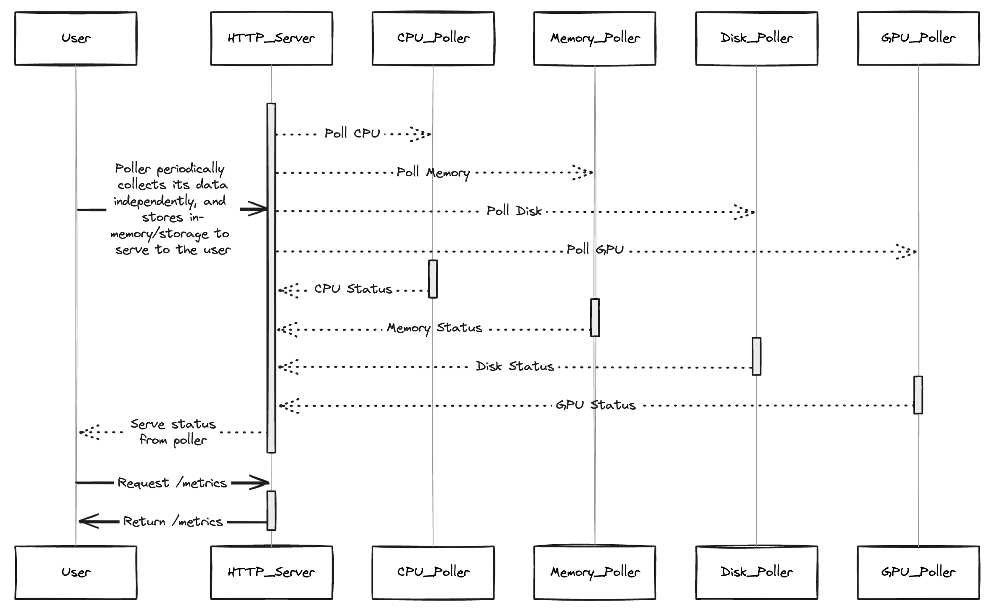

# How it works

GPUd remains idle, collects data only once per interval, with components efficiently sharing data for minimum resource overhead.

Each component implements its own collector to be called by the shared poller, and the metrics are returned from the last collected state. Which minimizes the request overheads.

## Code structure

- Each component implements the [`Component`](../components/components.go) interface (see [file descriptor](../components/fd/component.go) for an example).
- Each component has a unique name, description, and tags.
- Each component defines its own configuration.
- Each component implements its own "get" function to collect data.
- Different components may share the same poller when the data source is the same (e.g., nvidia error and info components share the same data source nvidia-smi).
